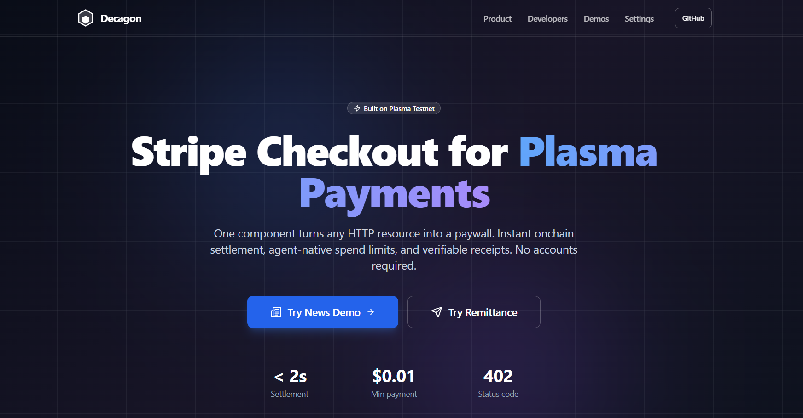

  

<h3 align="center">Stripe-like checkout for Plasma via HTTP 402</h3>

  <a href="https://decagon-core-web.vercel.app">Live Demo</a> · 
  <a href="https://github.com/Decagon-Pay/Decagon-core">Source Code</a> · 
  <a href="https://decagon-core-web.vercel.app/sdk-docs">SDK Docs</a> · 
  <a href="https://github.com/Decagon-Pay/Decagon-core/blob/main/EFFECTS.md">Architecture</a>

---

## What is Decagon?

Decagon turns any HTTP endpoint into a paid resource using the **402 Payment Required** status code. Client requests a resource, server returns a payment challenge, client pays on Plasma, submits proof, and gets access. Standard HTTP, works with browsers, CLIs, and AI agents.

🔗 [Source Code](https://github.com/Decagon-Pay/Decagon-core) · 🎥 [Demo Video](https://youtu.be/YpXl7jhoO6c)

## 💎 Plasma Payments Bounty

**What we built:**

- **HTTP 402 Protocol** / Any resource can return `402 Payment Required` with a payment challenge. The client pays on-chain on Plasma, submits the transaction hash, and gets instant access. No custom integration needed.

- **Drop-in SDK** / One `<PaymentSheet />` React component handles wallet connection, transaction signing, verification, and receipts. Add payments to any app in minutes. → [SDK Docs](https://decagon-core-web.vercel.app/sdk-docs)

- **Two Live Demos** / Pay-per-article [news paywall](https://decagon-core-web.vercel.app/news) and [cross-border remittance](https://decagon-core-web.vercel.app/remittance), both settling instantly on Plasma testnet with sub-cent fees.

- **Agent-Native Payments** / Scoped agent tokens with daily spend caps and path allowlists let AI agents pay for resources autonomously within policy bounds.

**Why it matters:** Users never think about crypto. They click "Unlock", MetaMask signs, content appears in under 2 seconds. The 402 standard means every API, every paywall, every SaaS can accept Plasma payments with zero custom integration. One protocol, infinite verticals.

## 🏗 Effectful Programming Bounty

**Runtime:** TypeScript + [Effect](https://effect.website)

Decagon's entire backend is built on Effect. Every side effect (persistence, on-chain RPC, time, ID generation, logging) is modeled as a typed capability interface and injected at the application boundary.

- **13 capability interfaces** define all I/O boundaries: `PaymentVerifier`, `ReceiptsStore`, `ChallengesStore`, `Clock`, `PlasmaRpc`, `PolicyStore`, and more
- **Pure workflows** compose capabilities via `Effect.gen`: `getArticle`, `verifyPaymentAndIssueSession`, `createTransfer`, `checkPaymentPolicy`
- **Two provider layers**: in-memory mocks for development, SQLite + RPC for production, swapped via `Effect.provide()` at the Fastify route boundary
- **Zero scattered side effects**: business logic never touches the database, network, or clock directly

📄 [Full architecture doc](https://github.com/Decagon-Pay/Decagon-core/blob/main/EFFECTS.md)